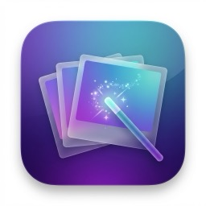

# Pictools

<p align="center">
  
</p>

<p align="center">
  <strong>一款跨平台图片工具集合应用</strong>
</p>

<p align="center">
  <a href="#功能特性">功能特性</a> •
  <a href="#安装">安装</a> •
  <a href="#使用">使用</a> •
  <a href="#开发">开发</a> •
  <a href="#路线图">路线图</a>
</p>

---

## 功能特性

Pictools 是一个图片工具集合平台，提供多种实用的图片处理功能。

### 🔍 图片对比

快速对比两张图片的差异，支持三种对比模式：

- **滑块模式** - 拖动分割线左右对比
- **并排模式** - 两张图片左右并排显示  
- **叠加模式** - 可调节透明度查看叠加效果

### ✂️ 图片调整

强大的图片尺寸调整和裁剪工具：

- **尺寸调整** - 自定义宽高，支持锁定比例
- **比例裁剪** - 支持自由裁剪和预设比例（1:1, 4:3, 16:9 等）
- **多格式导出** - 支持 PNG、JPG、**WebP** 格式
- **高性能编码** - 使用 Rust 原生库进行图片编码，性能优异

### ☀️ 亮度增强

一键提升图片亮度，改善暗部细节：

- **智能增强** - 自动调整曝光、高光/阴影和饱和度
- **实时对比** - 左右对比预览原图与增强效果
- **Rust 加速** - 使用 Rust 原生算法，处理速度快

###  🎯 主体抠图 ⭐ 新增

使用 AI 智能抠图去除背景：

- **ONNX 模型** - 基于 RMBG-2.0 模型，抠图效果精准
- **三种精度** - 支持 Full/FP16/INT8 三种模型精度选择
- **实时预览** - 左右对比查看原图与抠图结果
- **背景填充** - 支持纯色背景填充，自定义颜色，一键清除背景
- **灵活导出** - PNG 透明导出或 JPG 带背景导出
- **内置引擎** - 内置 ONNX Runtime (ort)，无需手动安装任何依赖
- **Rust 加速** - 使用 Rust 原生库进行高性能推理

> 💡 首次使用需联网下载模型文件（FP16 约 500MB），模型存储在本地应用数据目录。

### 🪟 多窗口功能 ⭐ v1.0.3 新增

每个工具都可以独立打开在新窗口中：

- **独立窗口** - 点击工具右上角按钮，在新窗口中打开
- **多任务处理** - 同时在不同窗口处理多个图片
- **窗口间协作** - 配合剪切板功能，轻松在窗口间传递图片

### 📋 跨窗口剪切板 ⭐ v1.0.3 新增

强大的图片复制粘贴功能，支持跨窗口操作：

- **右键菜单** - 在任意图片上右键即可复制/粘贴
- **跨窗口共享** - 从一个窗口复制，在另一个窗口粘贴
- **粘贴替换** - 支持直接替换现有图片
- **缩略图预览** - 粘贴时显示图片预览
- **高效工作流** - 配合多窗口功能，实现高效图片处理

<details>
<summary>📸 截图预览</summary>

<!-- 待添加截图 -->

</details>

## 安装

### Android

Android 版本支持图片对比、裁剪与缩放、Rust 亮度增强和格式转换。所有图片处理均在设备本地完成，正式版不申请网络权限。
主体抠图暂不在 Android 提供，原因是当前 RMBG-2.0 模型体积为 366MB–1GB，CPU 推理的内存与耗时不适合作为移动端首发能力。

界面默认跟随系统语言，不支持的系统语言回退为简体中文；可在设置中选择简体中文、繁体中文、英语、西班牙语、法语或德语。设置页内置本地隐私政策入口。

Google Play 发布构建与签名步骤见 [Android 发布检查清单](docs/GOOGLE_PLAY_RELEASE.md)。

### iOS

iOS 版本支持图片对比、裁剪与缩放、亮度增强和格式转换。图片编解码、裁剪缩放和亮度增强通过应用内置的 Rust 原生库在设备本地执行；主体抠图和多窗口仅在桌面版提供。iOS 通过系统文件选择器导入和导出图片，不申请相册权限。

App Store 发布构建、签名和审核资料见 [iOS 发布检查清单](docs/IOS_RELEASE.md)。

### macOS

1. 从 [Releases](https://github.com/haoqiangyu/pictools/releases) 下载最新版本的 `Pictools.zip`
2. 解压后将 `pictools.app` 拖入应用程序文件夹
3. 首次打开时，右键点击 → 选择"打开" → 确认打开

> ⚠️ 由于未进行 Apple 公证，首次打开可能需要在"系统设置 → 隐私与安全性"中允许运行

### 从源码构建

```bash
# 克隆仓库
git clone https://github.com/haoqiangyu/pictools.git
cd pictools

# 使用 fvm 安装 Flutter 版本
fvm use

# 获取依赖
fvm flutter pub get

# 运行开发版
fvm flutter run -d macos

# 构建发布版
fvm flutter build macos --release
```

> 💡 从源码构建需要安装 [Rust](https://rustup.rs/) 工具链

## 使用

1. **启动应用** - 打开 Pictools，进入工具集合首页
2. **选择工具** - 点击需要的工具卡片进入功能页面
3. **使用功能** - 按照各工具的指引完成操作
4. **返回首页** - 点击左上角返回按钮回到工具集合

### 图片对比使用

1. 上传两张待对比的图片（拖拽或点击上传）
2. 在底部选择对比模式（滑块/并排/叠加）
3. 在对比区域查看差异
4. 悬停图片可复制文件完整路径

### 图片调整使用

1. 上传待调整的图片
2. 选择调整模式（尺寸调整/比例裁剪）
3. 设置目标尺寸或裁剪区域
4. 选择导出格式（PNG/JPG/WebP）
5. 点击"导出图片"保存

### 跨窗口剪切板使用

1. **复制图片** - 在任意图片上右键，选择"复制图片"
2. **粘贴图片** - 在图片输入区右键，选择"粘贴图片"
3. **跨窗口操作** - 从窗口 A 复制的图片可以在窗口 B 粘贴
4. **替换图片** - 已有图片时，右键可选择"粘贴替换"

## 开发

### 技术栈

- **框架**: Flutter 3.44.6
- **平台**: Android、iOS、macOS
- **状态管理**: Provider
- **图片处理**: Android、iOS 与 macOS 的亮度增强和图片编解码使用 Rust（通过 flutter_rust_bridge）
- **依赖库**:
  - `file_picker` - 文件选择
  - `desktop_drop` - 拖拽上传
  - `image` - 图片解码处理
  - `flutter_rust_bridge` - Rust FFI 绑定

### 项目结构

```
lib/
├── main.dart                 # 应用入口
├── models/                   # 数据模型
├── providers/                # 状态管理
├── screens/
│   ├── home_screen.dart      # 工具集合首页
│   ├── image_compare_screen.dart  # 图片对比
│   ├── image_adjust_screen.dart   # 图片调整
│   └── image_enhance_screen.dart  # 亮度增强
├── src/rust/                 # Rust FFI 生成代码
├── theme/                    # 主题配置
└── widgets/                  # UI 组件

rust/
└── src/api/
    ├── image_codec.rs        # Rust 图片编码模块
    └── image_enhance.rs      # Rust 亮度增强算法
```

### 添加新工具

1. 在 `lib/models/tool_item.dart` 的 `Tools.all` 列表中添加新 `ToolItem`
2. 创建对应的功能页面（如 `lib/screens/xxx_screen.dart`）
3. 在 `lib/main.dart` 中添加路由配置

## 路线图

- [x] 🏠 工具集合入口首页
- [x] 🔍 图片对比功能
- [x] ✂️ 图片裁剪/缩放
- [x] 🖼️ 图片格式转换 (PNG/JPG/WebP)
- [x] ☀️ 亮度增强
- [x] 🪟 多窗口支持
- [x] 📋 跨窗口剪切板
- [x] 🎯 主体抠图 (RMBG-2.0 ONNX)
- [ ] 🗜️ 图片压缩
- [ ] 🎨 批量处理
- [ ] 🪟 Windows 支持
- [ ] 🐧 Linux 支持

## 贡献

欢迎提交 Issue 和 Pull Request！

## 许可证

[MIT License](LICENSE)

---

<p align="center">
  Made with ❤️ by <a href="https://github.com/haoqiangyu">haoqiangyu</a>
</p>
